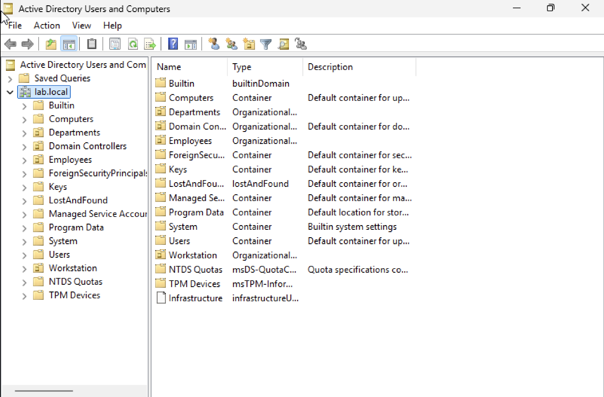
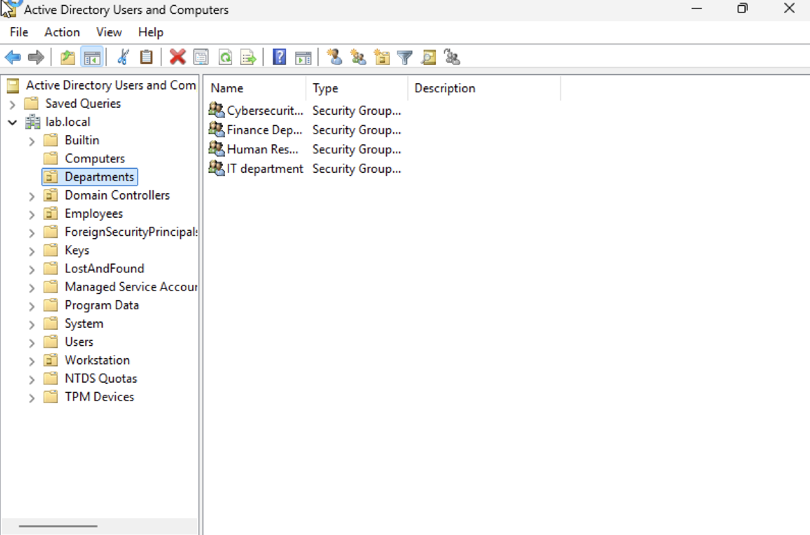
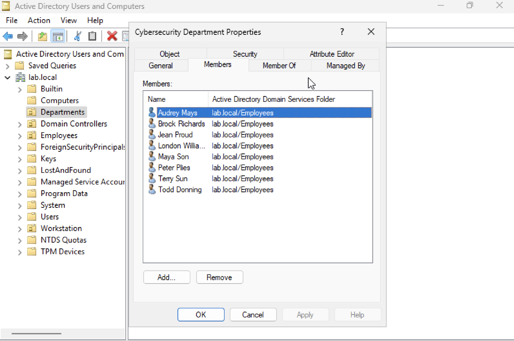
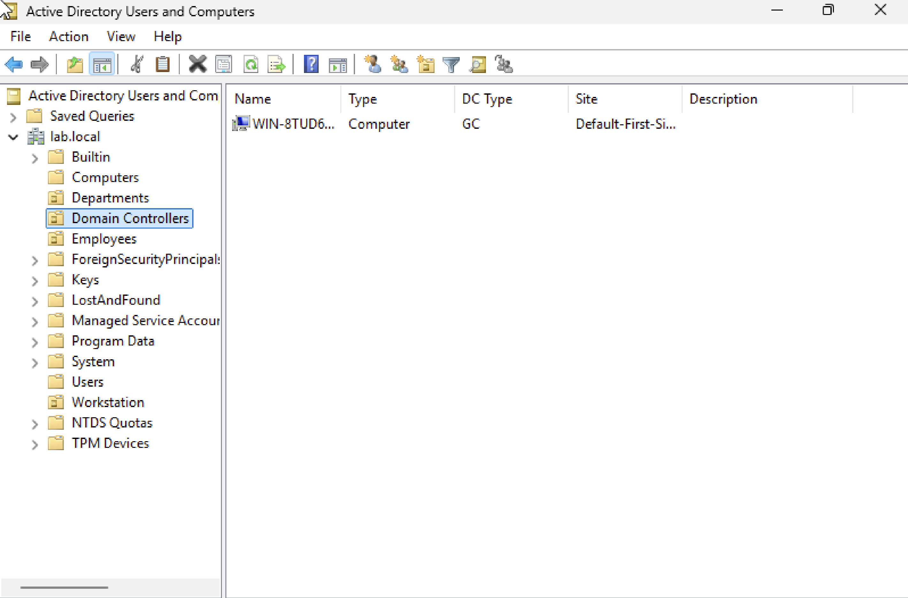
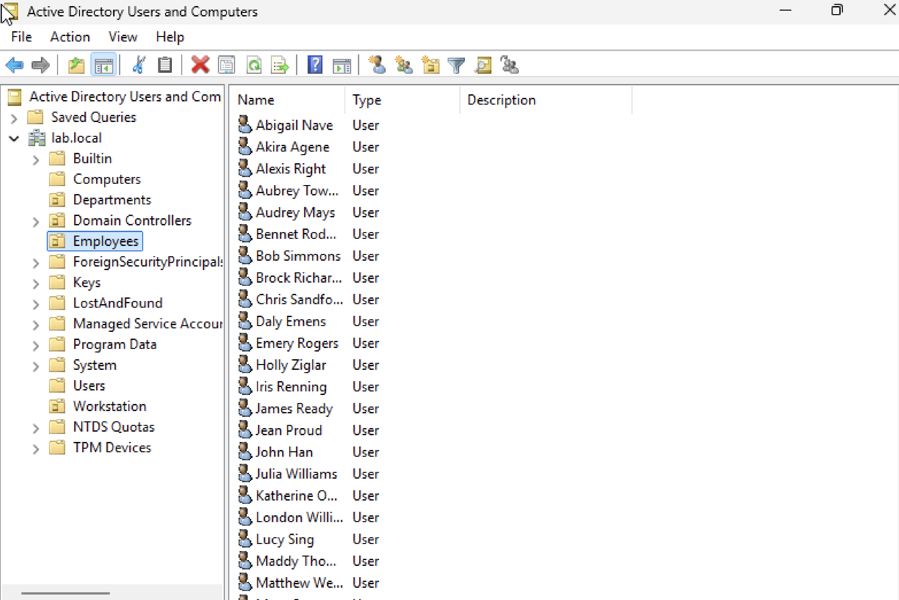
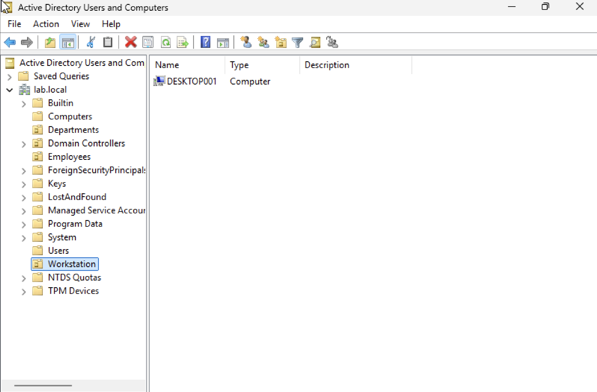

# Active Directory Home Lab

## Project Overview
Built a Windows Server home lab using Active Directory Domain Services (AD DS) to simulate common help desk and IT support tasks. This project demonstrates user management, organizational structure, and domain-based system administration in a controlled environment.

---

## Environment
- **Platform:** UTM (Virtualization)
- **Server OS:** Windows Server
- **Client OS:** Windows 11
- **Domain Name:** lab.local

---

## Lab Setup

### Domain Controller
- Promoted Windows Server to Domain Controller
- Configured Active Directory Domain Services
- Created domain: `lab.local`

---

### Organizational Units (OU Structure)
Created a structured environment to simulate a business:

- Departments
- Employees
- Workstation

---

### Security Groups
Created department-based security groups:

- Cybersecurity Department
- Finance Department
- Human Resources
- IT Department

---

### User Management
- Created multiple employee user accounts
- Organized users within the **Employees OU**
- Practiced account management concepts

---

### Domain-Joined Workstation
- Joined Windows client machine to domain
- Verified device in Active Directory under **Workstation OU**

---

## Skills Demonstrated
- Active Directory Users and Computers (ADUC)
- User and group management
- Organizational Unit (OU) design
- Domain controller setup
- Domain joining (Windows client)
- Basic system administration
- IT support workflow simulation

---

## Screenshots

### 1. Active Directory Structure
Shows overall domain structure with OUs (Departments, Employees, Workstation)

---

### 2. Department Security Groups
Shows created security groups inside Departments OU

---

### 3. Domain Controller
Shows the domain controller under Domain Controllers

---

### 4. Employee User Accounts
Shows multiple created users inside Employees OU

---

### 5. Domain-Joined Workstation
Shows workstation successfully joined to domain

---

## Common Tasks Practiced
- Created and managed user accounts
- Organized users into departments
- Created and assigned security groups
- Joined a workstation to the domain
- Navigated Active Directory structure
- Verified user and device objects

---

## Why This Project Matters
This lab simulates real-world help desk responsibilities, including:

- Account management
- Supporting domain-joined systems
- Understanding organizational access control
- Working within Active Directory environments

---

## Resume Bullet
Built a Windows Server home lab using Active Directory to manage users, groups, organizational units, and a domain-joined workstation in a simulated business environment.

---
